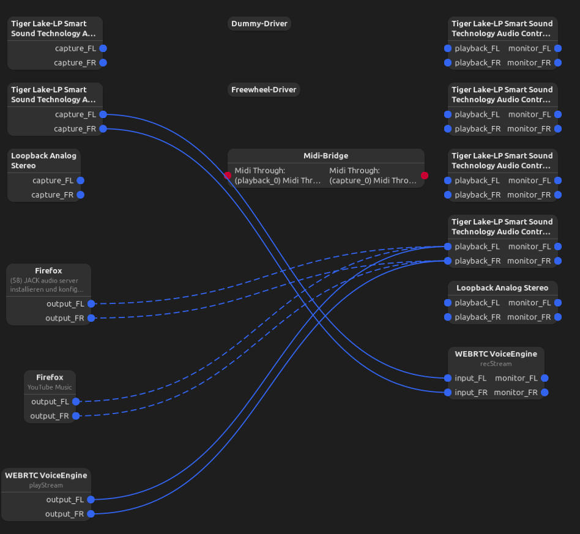
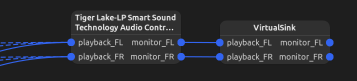

# Music-Visualizer

This project visualizes audio data in "near real time" in the browser using a spring boot backend and 
web-components. To route the audio to the java application pipewire is used.

This project is done in Ubuntu 24.04.2 LTS, it most likely will work similar on other linux distribution or ubuntu versions, on windows another audio rooting 
tool will be needed. 

## Setup of pipewire 
to begin with it might be a good idea to have a look into the pipewire website to understand what it
does [here](https://docs.pipewire.org/)

### 1) Install Dependencies

This step is necessary **only for Ubuntu versions earlier than 20.04 LTS**.

```bash
sudo apt install pipewire pipewire-audio-client-libraries pipewire-pulse pulseaudio
```

Additionally, install **Helvum**, a useful tool for debugging and visualizing audio configurations:

```bash
sudo apt install helvum
```

Once installed, open **Helvum**. Your initial view may look something like this:



In the example above, audio is routed to a single block on the right, which represents my headphones. If you use a different output device or sound controller, your setup may appear differently.

### 2) Creating and Connecting a Virtual Sink

Our goal is to create a **Virtual Sink** and connect our preferred output to it. This allows us to use the virtual sink later in a Java program or other applications.

#### Step 1: Identify the Active Audio Sink

Run the following command to list available sinks:

```bash
pactl list short sinks
```

Identify the active sink from the list—this is the one currently routing audio.

#### Step 2: Create and Link the Virtual Sink

Create a Virtual Sink and connect the identified output to it:

```bash
pactl load-module module-null-sink sink_name=VirtualSink sink_properties=device.description="VirtualSink"
pw-link <identified_sink> VirtualSink
```

Replace `<identified_sink>` with the name of your active sink from the previous command.

#### Step 3: Persisting the Configuration

To avoid repeating this setup after every reboot, consider adding these commands to a startup script.

### 3) Verify the Configuration

After completing the setup, your **Helvum** interface should look like this:



At this point, the Virtual Sink is ready for use!

---

#### Notes:

- Ensure that **PipeWire** is properly set up and running before proceeding.
- If you encounter issues, try restarting PipeWire with:

  ```bash
  systemctl --user restart pipewire
  ```

- For further debugging, use:

  ```bash
  pw-cli ls Node
  ```

  to list available nodes and check their connections.

This setup enables flexible audio routing, making it ideal for streaming, recording, or process

## Startup the Project 
    
As the project is only work in progress the readme will not be very detailed from here on

1. Run the MusicanalyzerApplicaion Spring application
2. then start the frontend with the dev script "npm run dev"

then go to the shown link and if it does not work out of the box with a reload it should show 
the current frequency output of your pc.